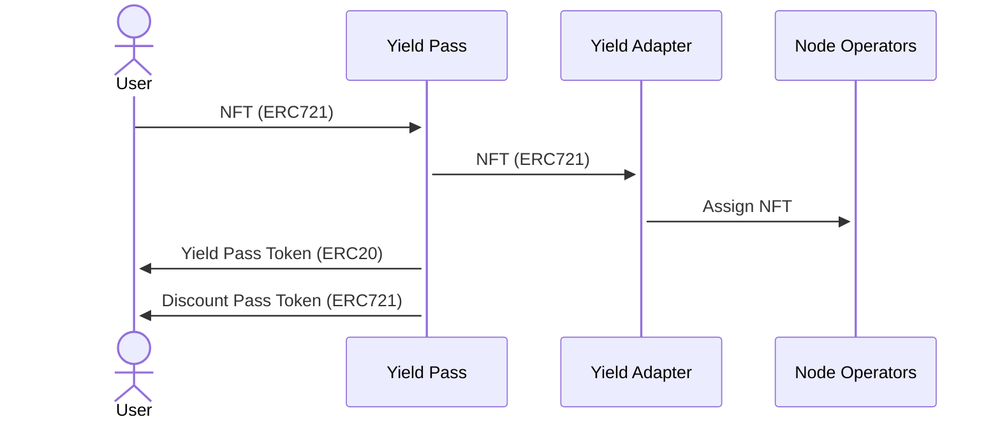
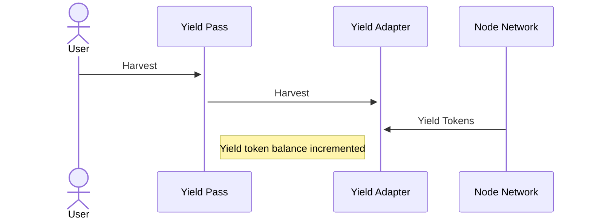
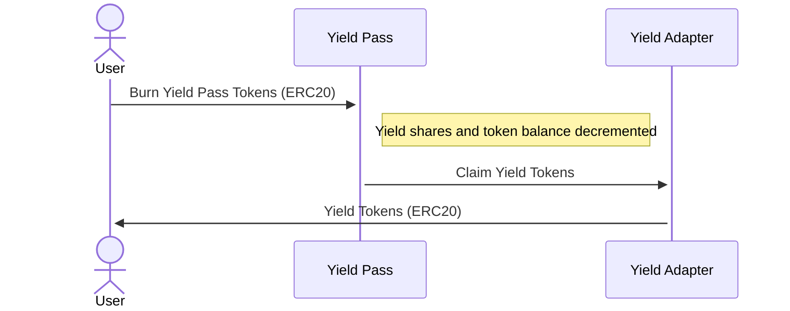
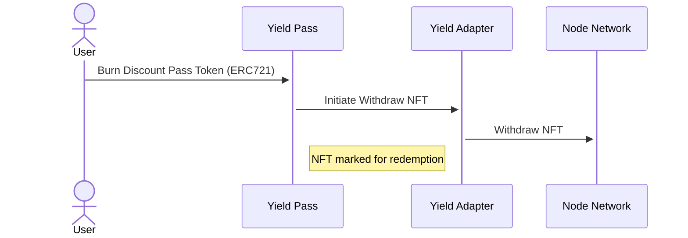

# Yield Pass

Yield Pass allows a user to tokenize the future yield (yield pass) and future
ownership (discount pass) of a productive NFT (i.e. yield generating) for a
fixed duration of time. This enables NFT owners to delegate the productivity of
their NFT to another operator, to trade the present value of its future yield,
to borrow against the NFT as collateral, or to sell the future ownership of the
NFT. It enables other users to purchase broad exposure to the NFT's yield
generation, to lend against the NFTs, or to purchase future ownership rights to
them.

See [`IYieldPass`](../src/interfaces/IYieldPass.sol) for the main factory contract interface.

## Minting

```solidity
/**
 * @notice Mint a yield pass and a discount pass for NFT token IDs
 * @param yieldPass Yield pass token
 * @param account Account holding NFT
 * @param tokenIds NFT Token IDs
 * @param yieldPassRecipient Yield pass recipient
 * @param discountPassRecipient Discount pass recipient
 * @param deadline Deadline
 * @param setupData Setup data
 * @param transferSignature Transfer signature
 * @return Yield pass amount
 */
function mint(
    address yieldPass,
    address account,
    uint256[] calldata tokenIds,
    address yieldPassRecipient,
    address discountPassRecipient,
    uint256 deadline,
    bytes calldata setupData,
    bytes calldata transferSignature
) external returns (uint256);
```

`mint()` is called by a user to mint yield pass and discount pass tokens for
one or more NFT token IDs. The function will escrow the NFT tokens with the
yield adapter, mint ERC20 yield pass tokens proportional to quantity of NFTs
and the yield market's expiry, and mint ERC721 discount pass tokens for each
NFT escrowed. The NFTs will be assigned for productive operation by the
associated yield adapter.



## Harvesting and Claiming Yield

```solidity
/**
 * @notice Harvest yield from yield adapter
 * @param yieldPass Yield pass token
 * @param harvestData Harvest data
 * @return Yield token amount harvested
 */
function harvest(address yieldPass, bytes calldata harvestData) external returns (uint256);
```

`harvest()` can be called periodically to harvest the yield tokens for
productive NFTs in escrow with the yield adapter, making the yield available
for claiming by yield pass token holders at expiry.



```solidity
/**
 * @notice Claim yield
 * @param yieldPass Yield pass token
 * @param recipient Recipient
 * @param amount Yield pass amount
 * @return Yield token amount
 */
function claim(address yieldPass, address recipient, uint256 amount) external returns (uint256);
```

`claim()` is called after yield market expiry to claim a proportional amount of
yield tokens in exchange for yield pass tokens. The yield pass tokens are
burned.



## Redeeming and Withdrawing NFTs

Exchanging the discount pass for the underlying NFT at yield market expiry is
done in two phases: `redeem()` and `withdraw()`, to accommodate the withdrawal
delay for some NFTs.

```solidity
/**
 * @notice Redeem discount pass
 * @param yieldPass Yield pass token
 * @param tokenIds NFT (and discount pass) token IDs
 */
function redeem(address yieldPass, uint256[] calldata tokenIds) external;
```

`redeem()` is called to initiate the withdrawal of the underlying NFT token IDs
of the supplied discount passes. The discount passes are burned, while the
token IDs are set aside for withdrawal while the redemption is in process.



``` solidity
/**
 * @notice Withdraw NFTs
 * @param yieldPass Yield pass token
 * @param recipient Recipient
 * @param tokenIds NFT token IDs
 */
function withdraw(address yieldPass, address recipient, uint256[] calldata tokenIds) external;
```

`withdraw()` is called to complete withdrawal of the underlying NFT token IDs
after the yield adapter's redemption process is complete.


## Deploying Yield Pass and Discount Pass Tokens

```solidity
/**
 * @notice Deploy Yield Pass for an NFT
 * @param token NFT token
 * @param startTime Start timestamp
 * @param expiry Expiry timestamp
 * @param isUserLocked True if token is user locked
 * @param adapter Yield adapter
 * @return Yield pass address, discount pass address
 */
function deployYieldPass(
    address token,
    uint64 startTime,
    uint64 expiry,
    bool isUserLocked,
    address adapter
) external returns (address, address);
```

`deployYieldPass()` is a permissioned function called to create a new yield
market for an NFT, with a given start time, expiration time, and yield adapter.
This creates the necessary accounting state in the yield pass factory, and
deploys the yield pass (ERC20) and discount pass (ERC721) tokens for the yield
market.

See the [`IYieldAdapter`](../src/interfaces/IYieldAdapter.sol) for the yield adapter interface.

## Yield Accounting

Yield pass tokens are minted proportionally to market expiry, starting at 1e18
yield pass tokens per NFT token ID at the start of the yield market. For
example, minting a quarter into the yield market lifetime for one NFT would
result in 0.75e18 yield pass tokens (ERC20) and one discount pass token
(ERC721).

Yield pass tokens represent shares of the total yield accrued by all NFTs
escrowed by the yield adapter, which are redeemable for a proportional amount
of yield tokens at market expiry.

This accounting assumes 1) a majority of the NFTs are assigned by the yield
adapter and are productive, and 2) yield generation is roughly even and linear
over the lifetime of the yield market.
