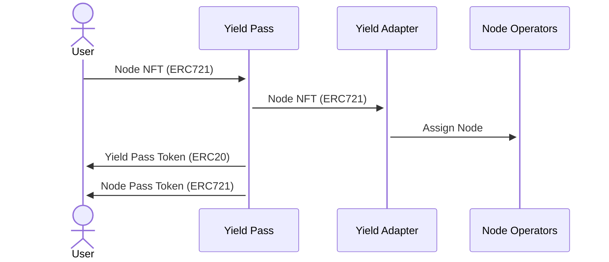
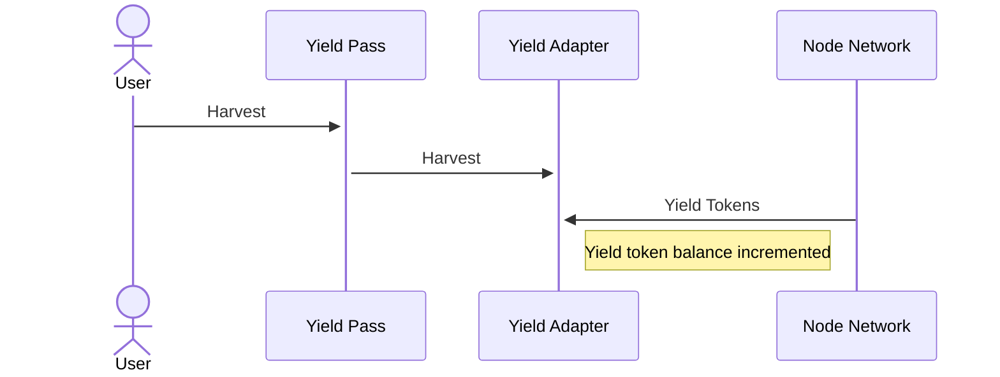
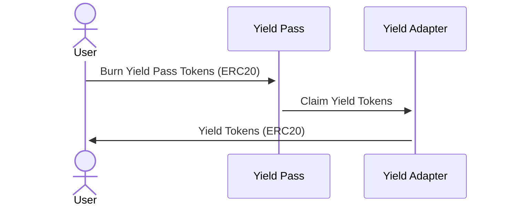
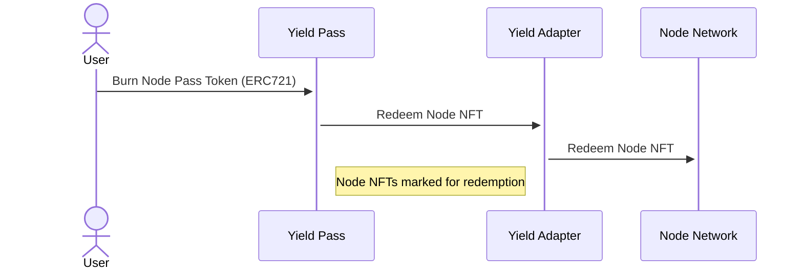
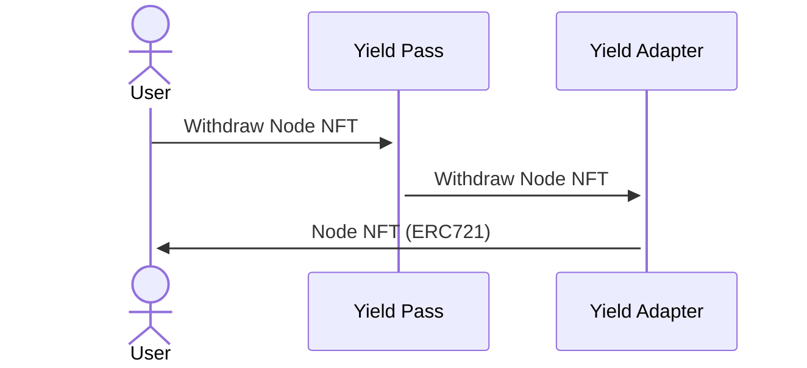

# Yield Pass

Yield Pass allows a user to tokenize the future yield (yield pass) and future
ownership (node pass) of a productive node NFT (i.e. yield generating) for a
fixed duration of time. This enables node owners to delegate the productivity
of their node, to trade the present value of its future yield, to borrow
against the node as collateral, or to sell the future ownership of the node. It
enables other users to purchase broad exposure to the node project's yield
generation, to lend against the nodes, or to purchase future ownership rights
to them.

See [`IYieldPass`](../src/interfaces/IYieldPass.sol) for the main factory contract interface.

## Minting

```solidity
/**
 * @notice Mint yield pass and node pass for node token IDs
 * @param yieldPass Yield pass token
 * @param yieldPassRecipient Yield pass recipient
 * @param nodePassRecipient Node pass recipient
 * @param deadline Deadline
 * @param nodeTokenIds Node token IDs
 * @param setupData Setup data
 * @return Yield pass amount
 */
function mint(
    address yieldPass,
    address yieldPassRecipient,
    address nodePassRecipient,
    uint256 deadline,
    uint256[] calldata nodeTokenIds,
    bytes calldata setupData
) external returns (uint256);
```

`mint()` is called by a user to mint yield pass and node pass tokens for one or
more node NFT token IDs. The function will escrow the node NFT tokens with the
yield adapter, mint ERC20 yield pass tokens proportional to the quantity of
node NFTs and the yield market's expiry, and mint ERC721 node pass tokens for
each node NFT escrowed. The nodes will be assigned for productive operation by
the associated yield adapter.



## Harvesting and Claiming Yield

```solidity
/**
 * @notice Harvest yield
 * @param yieldPass Yield pass token
 * @param harvestData Harvest data
 * @return Yield token amount harvested
 */
function harvest(address yieldPass, bytes calldata harvestData) external returns (uint256);
```

`harvest()` is called periodically to harvest the yield tokens from productive
node NFTs in escrow with the yield adapter, making the yield available for
claiming by yield pass token holders at expiry.



```solidity
/**
 * @notice Claim yield
 * @param yieldPass Yield pass token
 * @param recipient Recipient
 * @param yieldPassAmount Yield pass amount
 * @return Yield token amount
 */
function claim(address yieldPass, address recipient, uint256 yieldPassAmount) external returns (uint256);
```

`claim()` is called after yield market expiry to claim a proportional amount of
yield tokens in exchange for yield pass tokens. The yield pass tokens are
burned.



## Redeeming and Withdrawing NFTs

Node pass tokens are exchanged for the underlying node NFTs at yield market
expiry in two phases: `redeem()` and `withdraw()`, to accommodate the
withdrawal delay for some node NFTs.

```solidity
/**
 * @notice Redeem node passes
 * @param yieldPass Yield pass token
 * @param recipient Recipient
 * @param nodeTokenIds Node (and node pass) token IDs
 */
function redeem(address yieldPass, address recipient, uint256[] calldata nodeTokenIds) external;
```

`redeem()` is called to initiate the withdrawal of the underlying node token
IDs of the supplied node passes. The node passes are burned, and the node token
IDs are set aside for withdrawal while the redemption is in process.



``` solidity
/**
 * @notice Withdraw nodes
 * @param yieldPass Yield pass token
 * @param nodeTokenIds Node token IDs
 */
function withdraw(address yieldPass, uint256[] calldata nodeTokenIds) external;
```

`withdraw()` is called to complete withdrawal of the underlying node token IDs
after the yield adapter's redemption process is complete.



## Deploying Yield Pass and Node Pass Tokens

```solidity
/**
 * @notice Deploy Yield Pass and Node Pass tokens for a node token
 * @param nodeToken Node token
 * @param startTime Start timestamp
 * @param expiryTime Expiry timestamp
 * @param adapter Yield adapter
 * @return Yield pass address, node pass address
 */
function deployYieldPass(
    address nodeToken,
    uint64 startTime,
    uint64 expiryTime,
    address adapter
) external returns (address, address);
```

`deployYieldPass()` is a permissioned function called to create a new yield
market for a node NFT, with a given start time, expiration time, and yield
adapter. This creates the necessary accounting state in the yield pass factory,
and deploys the yield pass (ERC20) and node pass (ERC721) tokens for the yield
market.

See the [`IYieldAdapter`](../src/interfaces/IYieldAdapter.sol) for the yield adapter interface.

## Yield Accounting

Yield pass tokens are minted proportionally to market expiry, starting at 1e18
yield pass tokens per node token ID at the start of the yield market. For
example, minting a quarter into the yield market lifetime for one node NFT
would result in 0.75e18 yield pass tokens (ERC20) and one node pass token
(ERC721).

Yield pass tokens represent shares of the total yield accrued by all node NFTs
escrowed by the yield adapter, which are redeemable for a proportional amount
of yield tokens at market expiry.

This accounting assumes 1) a majority of the node NFTs assigned by the yield
adapter are productive, and 2) yield generation is roughly even and linear over
the lifetime of the yield market.
