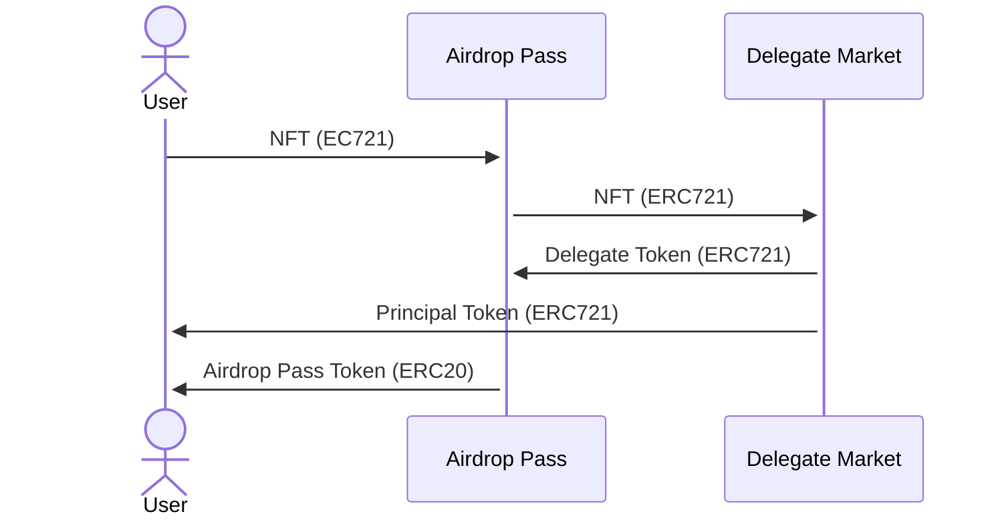
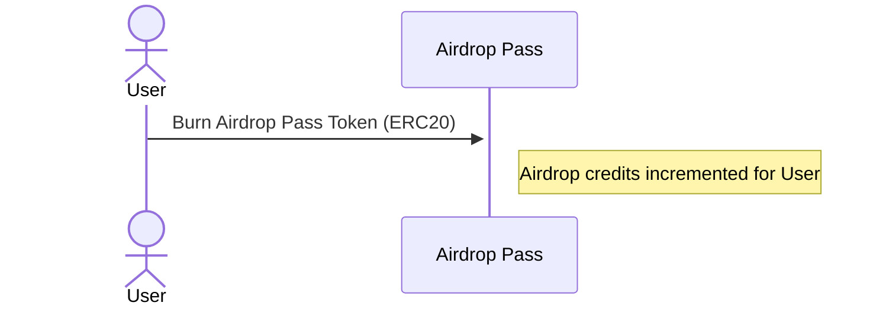
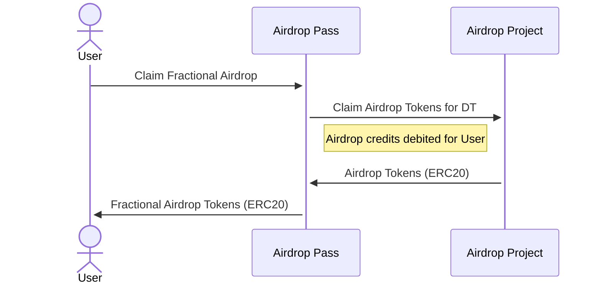
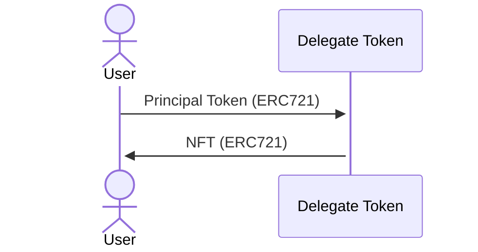

# Airdrop Pass

The Airdrop Pass is a tokenized right to an NFT's airdrop(s). It's implemented
as an ERC20 wrapper around [Delegate Market](https://github.com/delegatexyz/delegate-market) Delegate Tokens, with support for
claiming airdrop tokens. Airdrop passes can be minted from an NFT for a fixed
duration and then traded on DEXes. When airdrops become available for the
associated NFT, users can burn their airdrop passes in exchange for claiming
the actual airdrop tokens. After airdrop passes (and the delegate and principal
tokens) expire, principal token holders can claim the underlying NFT.

See [`IAirdropPass`](../src/interfaces/IAirdropPass.sol) for the main contract interface.

## Minting

```solidity
/**
 * @notice Mint a airdrop pass token
 * @param token Token address
 * @param tokenId Token ID
 * @param expiry Expiry
 * @param rights Rights
 * @return Principal token ID
 */
function mint(address token, uint256 tokenId, uint256 expiry, bytes32 rights) external returns (uint256);
```

`mint()` can be called to mint an airdrop pass token and principal token from
an NFT. This function will create a delegation for the NFT, escrow the delegate
token with the airdrop pass contract, mint the principal token to the caller,
and mint 1e18 airdrop pass tokens to the caller.



## Burning / Claiming Airdrops

```solidity
/**
 * @notice Burn airdrop pass token
 * @param airdropPassToken Airdrop pass token
 * @param amount Amount to claim
 */
function burn(address airdropPassToken, uint256 amount) external;
```

`burn()` can be called to burn airdrop pass tokens in exchange for airdrop
credits, which can then be used to fractionally claim one or more airdrops.
Once airdrop pass tokens are burned, they cannot be reminted, as the associated
delegate token(s) are held in escrow until expiry.



```solidity
/**
 * @notice Claim airdrop
 * @param airdropPassToken Airdrop pass token
 * @param airdropId Airdrop ID
 */
function claim(address airdropPassToken, uint256 airdropId) external;
```

`claim()` can be called to claim airdrop tokens with airdrop credits (issued by
`burn()`). Each airdrop pass token will have one or more associated airdrop
adapters to facilitate the actual claim of airdrop tokens. Airdrop credits can
be used independently for each airdrop adapters to claim all airdrop tokens
available for an NFT. Claims can be made fractionally.



In practice, `burn()`, followed by several calls to `claim()`, can be
multicalled to claim all airdrop tokens in one transaction.

## Burning / Claiming NFTs

The underlying NFT can be claimed directly by the principal token holder by
calling [`withdraw()`](https://github.com/delegatexyz/delegate-market/blob/main/src/interfaces/IDelegateToken.sol#L98) on Delegate Market Delegate Token contract.



## Deploying Airdrop Pass Token

```solidity
/**
 * @notice Deploy airdrop pass token
 * @param token Token address
 * @param expiry Expiry
 * @param rights Rights
 * @return Deployment address
 */
function deployAirdropPassToken(address token, uint256 expiry, bytes32 rights) external returns (address);
```

`deployAirdropPassToken()` is used to deploy an airdrop pass token for a given
a NFT collection address, expiry timestamp, and delegation rights. Currently,
this function is privileged because airdrop adapters must be manually
configured for each airdrop pass.

## Configuring Airdrop Adapters

```solidity
/**
 * @notice Set airdrop adapter for given airdrop pass token
 * @param airdropPassToken Airdrop pass token
 * @param airdropIndex Airdrop index
 * @param adapter Airdrop adapter
 */
function setAirdropAdapter(address airdropPassToken, uint256 airdropIndex, address adapter) external;
```

`setAirdropAdapter()` is used to associate an airdrop adapter with an airdrop
pass token. Airdrop passes can have multiple airdrop adapters, representing
different future airdrops available to claim. Each airdrop adapter is
identified by an airdrop id.

See the [`IAirdropAdapter`](../src/interfaces/IAirdropAdapter.sol) interface for an airdrop adapter.
